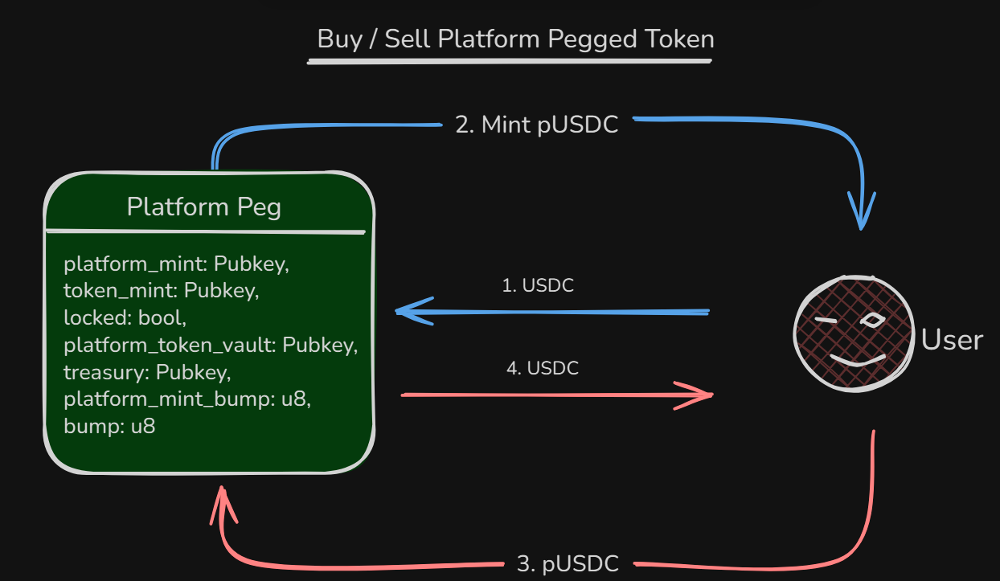
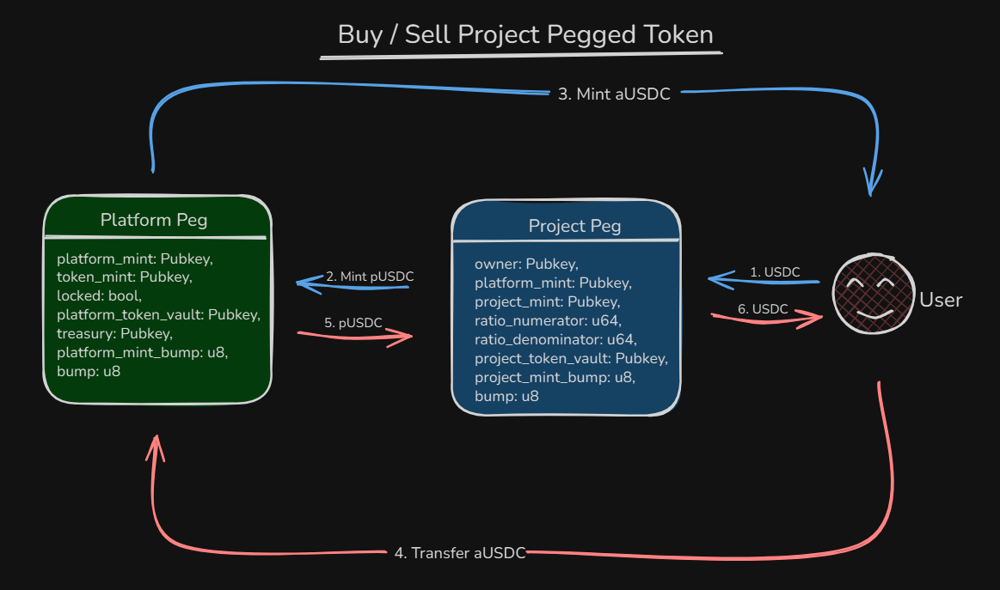

# Overview - Pegging Factory

This is a Turbine Capstone project, Pegging Factory is a program that allows project to create there own pegged token based on ratio with the low liquidity.

## Platform Peg
Platform peg is the first layer, this helps provide the liquidity to other project pegged token.



## Project Peg
Project Peg is the second layer where an other project can launch their own peg with any ratio.



## Usage
Start up a test validator:
```bash
solana-test-validator
```
Then run:

```bash
anchor build
anchor deploy
```
Once deployed, ensure the program is matches in programs/vault/lib.rs and Anchor.toml
Ensure that your wallet it set in the Anchor.toml and the wrongwallet in the test and both are funded with sol depending on the network (Devnet / localnet)

```bash
anchor test --skip-test-validator
```